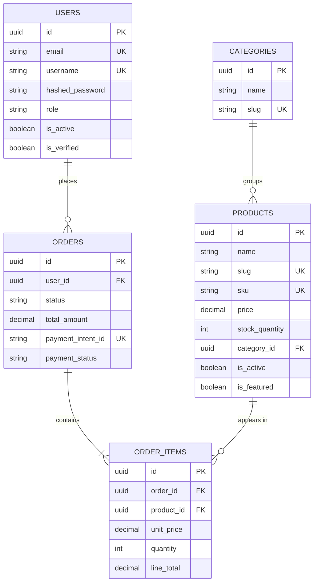

# ShopWave E-Commerce — Complete Codebase & Deployment Analysis

> **Date:** April 2026 | **Stack:** FastAPI · React 19 · PostgreSQL 18 · Docker · MCP  
> **Scope:** Architecture review, MCP integration map, deployment strategy

---

## 1. Codebase Architecture Summary

### 1.1 Project Structure

```
ecommerce/
├── backend/                  # FastAPI application
│   ├── app/
│   │   ├── api/v1/endpoints/ # REST controllers (auth, users, products, categories, orders)
│   │   ├── core/             # config.py, security.py, dependencies.py
│   │   ├── db/               # session.py, base.py — async SQLAlchemy
│   │   ├── models/           # User, Product, Category, Order, OrderItem
│   │   ├── schemas/          # Pydantic v2 request/response models
│   │   ├── utils/            # mcp_client.py — MCP JSON-RPC wrapper
│   │   └── main.py           # App factory + lifespan
│   ├── alembic/              # Database migrations
│   └── Dockerfile            # Multi-stage build (builder → runtime)
│
├── frontend/                 # React 19 SPA
│   ├── src/
│   │   ├── components/       # features/ (PaymentModal), layout/ (Navbar, Footer), ui/ (ProductCard, Spinner)
│   │   ├── hooks/            # useAuth, useCart, useSemanticSearch
│   │   ├── pages/            # Home, Products, ProductDetail, Cart, Checkout, Orders, Profile, Auth
│   │   ├── services/         # api.js (Axios), auth.service.js
│   │   └── store/            # authStore.js, cartStore.js (Zustand + persist)
│   └── Dockerfile            # Node build → Nginx runtime
│
├── mcp-servers/              # 6 standalone MCP microservices
│   ├── inventory/            # Port 8001 — stock intelligence
│   ├── payments/             # Port 8002 — Razorpay integration
│   ├── search/               # Port 8003 — pgvector semantic search
│   ├── notifications/        # Port 8004 — SendGrid transactional email
│   ├── analytics/            # Port 8005 — BI queries
│   └── content/              # Port 8006 — Claude AI content generation
│
├── nginx/                    # Frontend reverse proxy config
├── docker-compose.yml        # 3-service stack (db + backend + frontend)
└── docs/                     # implementation_sequence_guide.md (1,423 lines)
```

### 1.2 Backend Architecture

| Layer | Technology | Key Notes |
|-------|-----------|-----------|
| **Framework** | FastAPI 0.115+ | Async endpoints, dependency injection |
| **ORM** | SQLAlchemy 2.x (Async) | `AsyncSession`, `mapped_column` syntax |
| **Migrations** | Alembic | URL overridden at runtime from Settings |
| **Auth** | JWT (PyJWT) | Access (memory) + Refresh (HttpOnly cookie) |
| **Password** | `pwdlib` + Argon2 | Memory-hard hashing, constant-time verify |
| **Settings** | Pydantic-Settings | `.env` file loading, type validation |
| **ASGI Server** | Uvicorn | 2 workers in production |

**5 API Routers:**
- `/api/v1/auth` — login, register, refresh, logout
- `/api/v1/users` — profile CRUD
- `/api/v1/products` — public listing + admin CRUD
- `/api/v1/categories` — category management
- `/api/v1/orders` — order placement + admin status updates

### 1.3 Frontend Architecture

| Layer | Technology | Key Notes |
|-------|-----------|-----------|
| **Framework** | React 19 + Vite 6 | Fast HMR in dev, content-hashed builds |
| **Styling** | Tailwind CSS | Utility-first, responsive |
| **State** | Zustand + persist | Auth & cart state survive page refreshes |
| **Data Fetching** | TanStack Query v5 | Cache, dedup, background refetch |
| **HTTP** | Axios | Request/response interceptors for auth |
| **Routing** | React Router v7 | ProtectedRoute wrappers |

**8 Pages:** Home, Products, ProductDetail, Cart, Checkout, Orders, Profile, Auth

### 1.4 Database Schema



---

## 2. MCP Server Inventory & Analysis

### 2.1 Complete MCP Map

All 6 MCP servers communicate via **JSON-RPC 2.0 over HTTP** (`/messages` endpoint). The FastAPI backend acts as the sole MCP **Client** using `httpx.AsyncClient`.

| # | Server | Port | External API | Status |
|---|--------|------|-------------|--------|
| 1 | `mcp-inventory` | 8001 | PostgreSQL (direct `asyncpg`) | ✅ Server code exists |
| 2 | `mcp-payments` | 8002 | Razorpay API | ✅ Server code exists |
| 3 | `mcp-search` | 8003 | PostgreSQL + pgvector, Anthropic Embeddings | ✅ Server code exists |
| 4 | `mcp-notifications` | 8004 | SendGrid API | ✅ Server code exists |
| 5 | `mcp-analytics` | 8005 | PostgreSQL (aggregate queries) | ✅ Server code exists |
| 6 | `mcp-content` | 8006 | Anthropic Claude API | ✅ Server code exists |

### 2.2 Per-Server Tool Breakdown

#### `mcp-inventory` (Port 8001)

| Tool | Input | Output | External Dependency |
|------|-------|--------|-------------------|
| `check_stock_levels` | `product_ids: list[str]` | Stock report per product | PostgreSQL `products` table |
| `suggest_reorder` | `product_id, lead_time_days` | Reorder recommendation with quantity | PostgreSQL + business rules |
| `bulk_update_stock` | `updates: list[{id, quantity}]` | Batch update confirmation | PostgreSQL `products` table |

#### `mcp-payments` (Port 8002)

| Tool | Input | Output | External Dependency |
|------|-------|--------|-------------------|
| `create_payment_intent` | `order_id, amount, currency` | Razorpay order object | Razorpay Orders API |
| `verify_payment` | `payment_id, order_id, signature` | HMAC verification result | Razorpay (constant-time compare) |
| `process_refund` | `payment_id, amount, reason` | Refund confirmation | Razorpay Refunds API |

#### `mcp-search` (Port 8003)

| Tool | Input | Output | External Dependency |
|------|-------|--------|-------------------|
| `semantic_search` | `query, limit, filters` | Ranked product results with similarity scores | pgvector + Anthropic `voyage-3` embeddings |
| `index_product` | `product_data dict` | Index confirmation | pgvector INSERT |
| `reindex_catalogue` | *(none)* | Full reindex status | PostgreSQL + Anthropic API |

#### `mcp-notifications` (Port 8004)

| Tool | Input | Output | External Dependency |
|------|-------|--------|-------------------|
| `send_order_confirmation` | `to_email, order_id, order_details` | SendGrid delivery status | SendGrid Mail Send API |
| `send_shipping_update` | `to_email, order_id, tracking_info` | Delivery status | SendGrid Mail Send API |
| `send_promotional_email` | `to_emails, subject, content` | Batch send report | SendGrid Mail Send API |

#### `mcp-analytics` (Port 8005)

| Tool | Input | Output | External Dependency |
|------|-------|--------|-------------------|
| `get_sales_summary` | `date_from, date_to` | Revenue, order count, avg order value | PostgreSQL aggregate queries |
| `get_top_products` | `limit, metric (revenue\|quantity)` | Ranked product performance | PostgreSQL aggregate queries |
| `get_stock_report` | *(none)* | Low stock alerts, total value | PostgreSQL `products` table |

#### `mcp-content` (Port 8006)

| Tool | Input | Output | External Dependency |
|------|-------|--------|-------------------|
| `generate_product_description` | `name, category, features, target` | SEO-optimised description | Anthropic Claude API |
| `generate_seo_metadata` | `name, description, category` | Title tag + meta description | Anthropic Claude API |

### 2.3 MCP Communication Architecture

```
┌─────────────┐     HTTP/JSON-RPC 2.0     ┌──────────────────┐
│  FastAPI     │ ──────────────────────►   │  MCP Server      │
│  Backend     │   X-MCP-API-Key header    │  (FastMCP)       │
│              │                           │                  │
│  MCPClient   │ ◄──────────────────────   │  /messages       │
│  (httpx)     │   JSON response           │  /sse            │
└──────┬───────┘                           └────────┬─────────┘
       │                                            │
       │  SQLAlchemy                                │  asyncpg (direct)
       │  AsyncSession                              │  or external API
       ▼                                            ▼
 ┌─────────────┐                           ┌──────────────────┐
 │ PostgreSQL   │                           │ External Service │
 │ 18           │                           │ (Razorpay,       │
 │              │                           │  SendGrid,       │
 └──────────────┘                           │  Anthropic)      │
                                            └──────────────────┘
```

> [!IMPORTANT]
> **Authentication:** All MCP server calls include `X-MCP-API-Key` header with the shared `MCP_INTERNAL_API_KEY` secret for server-to-server auth.

---

## 3. Upcoming Segments & Gap Analysis

### 3.1 What's Missing from `docker-compose.yml`

The current `docker-compose.yml` only defines **3 services** (db, backend, frontend). The 6 MCP servers are **not yet wired** into the compose stack. Each needs:

```yaml
# Example: mcp-inventory service block (to be added)
mcp-inventory:
  build: ./mcp-servers/inventory
  container_name: shopwave_mcp_inventory
  environment:
    DATABASE_URL: postgresql+asyncpg://shopwave:shopwave_pass@db:5432/shopwave_db
    MCP_INTERNAL_API_KEY: ${MCP_INTERNAL_API_KEY}
  depends_on:
    db: { condition: service_healthy }
  networks:
    - shopwave_net
```

### 3.2 Missing Backend Integration Endpoints

The backend currently has **no API routes** that call MCP servers. The following endpoints need to be created:

| Endpoint | Method | MCP Server | Purpose |
|----------|--------|------------|---------|
| `/api/v1/search/semantic` | GET | `mcp-search` | Semantic product search |
| `/api/v1/products/{id}/stock` | GET | `mcp-inventory` | Real-time stock check |
| `/api/v1/admin/inventory/reorder` | POST | `mcp-inventory` | Reorder suggestions |
| `/api/v1/admin/inventory/bulk-update` | POST | `mcp-inventory` | Batch stock updates |
| `/api/v1/payments/create-intent` | POST | `mcp-payments` | Razorpay order creation |
| `/api/v1/payments/verify` | POST | `mcp-payments` | Payment signature verify |
| `/api/v1/payments/refund` | POST | `mcp-payments` | Process refund |
| `/api/v1/admin/analytics/sales` | GET | `mcp-analytics` | Sales dashboard data |
| `/api/v1/admin/analytics/top-products` | GET | `mcp-analytics` | Top product report |
| `/api/v1/admin/content/generate` | POST | `mcp-content` | AI product descriptions |
| `/api/v1/admin/content/seo` | POST | `mcp-content` | SEO metadata generation |
| `/api/v1/notifications/order-confirm` | POST | `mcp-notifications` | Order confirmation email |

### 3.3 Missing Frontend Components

| Component | Page | MCP Server | Purpose |
|-----------|------|------------|---------|
| `<SemanticSearchBar />` | Products, Home | `mcp-search` | AI-powered product search |
| `<AdminDashboard />` | Admin (new page) | `mcp-analytics` | Sales charts, top products |
| `<StockBadge />` | ProductDetail | `mcp-inventory` | Real-time stock indicator |
| `<ContentGenerator />` | Admin Products | `mcp-content` | AI description writer |
| `<RefundModal />` | Admin Orders | `mcp-payments` | Process refund flow |

### 3.4 Missing Infrastructure

| Item | Status | Required For |
|------|--------|-------------|
| pgvector extension | ❌ Not installed in DB | `mcp-search` semantic search |
| `product_embeddings` table | ❌ Not created | `mcp-search` vector storage |
| Alembic migration for embeddings | ❌ Not exists | `mcp-search` pgvector index |
| MCP health check endpoints | ✅ Each server has `/health` | Docker healthchecks |
| Rate limiting middleware | ❌ Missing | Production API protection |
| Redis for caching/sessions | ❌ Missing | Session store, MCP response cache |

---

## 4. Deployment Service Recommendations

### 4.1 Service Selection Matrix

| Category | **Recommended** | **Alternative** | **Why** |
|----------|----------------|-----------------|---------|
| **Database** | **Neon** (Serverless PG) | Supabase | Native pgvector, auto-scaling, branching for dev/staging |
| **Backend** | **Railway** | Render, Fly.io | Docker-native, easy env vars, auto-deploy from Git |
| **Frontend** | **Vercel** | Netlify, Cloudflare Pages | Best-in-class React/Vite support, edge CDN |
| **MCP Servers** | **Railway** (multi-service) | Fly.io | Each MCP server = separate Railway service, internal networking |
| **Object Storage** | **Cloudflare R2** | AWS S3 | Zero egress fees for product images |
| **Monitoring** | **Better Stack** | Datadog, Sentry | Log aggregation + uptime monitoring + incident management |
| **CI/CD** | **GitHub Actions** | GitLab CI | Native GitHub integration, free tier, matrix builds |
| **Secrets** | **Doppler** | GitHub Secrets | Centralized secret management across all environments |
| **Email** | **SendGrid** (already chosen) | Resend, Postmark | Transactional + marketing, generous free tier |
| **Payments** | **Razorpay** (already chosen) | Stripe | Indian market focus, UPI support |
| **AI/LLM** | **Anthropic** (already chosen) | OpenAI | Claude for content generation + embeddings |

### 4.2 Deployment Architecture

```
┌─────────────────────────────────────────────────────────────────────┐
│                        PRODUCTION STACK                              │
│                                                                     │
│  ┌──────────────┐     ┌──────────────────────────────────────────┐  │
│  │   Vercel      │     │          Railway (Private Network)       │  │
│  │   (Frontend)  │     │                                          │  │
│  │   React SPA   │────▶│  ┌─────────┐    ┌──────────────────┐   │  │
│  │   Edge CDN    │     │  │ FastAPI  │    │ MCP Servers (×6) │   │  │
│  └──────────────┘     │  │ Backend  │───▶│  inventory       │   │  │
│                        │  │          │    │  payments        │   │  │
│  ┌──────────────┐     │  │          │    │  search          │   │  │
│  │  Cloudflare   │     │  │          │    │  notifications   │   │  │
│  │  R2 Storage   │     │  │          │    │  analytics       │   │  │
│  │  (Images)     │     │  │          │    │  content         │   │  │
│  └──────────────┘     │  └────┬─────┘    └──────────────────┘   │  │
│                        │       │                                  │  │
│                        └───────┼──────────────────────────────────┘  │
│                                │                                     │
│                        ┌───────▼─────────┐                          │
│                        │  Neon           │                          │
│                        │  PostgreSQL 18  │                          │
│                        │  + pgvector     │                          │
│                        └─────────────────┘                          │
│                                                                     │
│  ┌──────────────┐  ┌──────────────┐  ┌──────────────────────────┐  │
│  │ GitHub       │  │ Better Stack │  │ Doppler                  │  │
│  │ Actions      │  │ Monitoring   │  │ Secrets Management       │  │
│  │ (CI/CD)      │  │ + Alerts     │  │                          │  │
│  └──────────────┘  └──────────────┘  └──────────────────────────┘  │
└─────────────────────────────────────────────────────────────────────┘
```

### 4.3 Cost Estimation (Monthly)

| Service | Free Tier | Starter (~$25/mo) | Growth (~$75/mo) |
|---------|-----------|-------------------|-------------------|
| **Neon** | 0.5 GB, 190h compute | 10 GB, always-on | 50 GB, auto-scaling |
| **Railway** | 500h/mo, $5 credit | $5/service (~7 services) | Autoscale, team plan |
| **Vercel** | 100 GB bandwidth | Pro ($20) | Enterprise |
| **Cloudflare R2** | 10 GB free | Pay-per-use | Pay-per-use |
| **SendGrid** | 100 emails/day | 50K emails/mo ($15) | 100K/mo |
| **GitHub Actions** | 2,000 min/mo | Included | Included |
| **Better Stack** | Basic logs | $24/mo | $48/mo |
| **Doppler** | 5 configs | $4/user/mo | Team plan |

> [!TIP]
> **Budget-conscious start:** Neon Free + Railway $5 credit + Vercel Free + GitHub Actions Free = **$0/month** for MVP launch.

### 4.4 Why These Choices?

#### Neon over Supabase for Database
- **Native pgvector support** — critical for `mcp-search` semantic search
- **Database branching** — create isolated DB copies for each PR/feature
- **Serverless architecture** — auto-scales down to zero during low traffic
- **Connection pooling** — built-in, no need for PgBouncer

#### Railway over Render for Backend + MCP Servers
- **Docker-native** — your existing Dockerfiles work without modification
- **Private networking** — MCP servers communicate over internal network (no public exposure)
- **Multi-service projects** — manage all 8 services (backend + 6 MCP + worker) in one project
- **Instant deploys** — typically 30-60 seconds vs Render's 5-10 minutes

#### Vercel over Netlify for Frontend
- **Edge Functions** — potential for SSR if needed later
- **Preview deployments** — every PR gets its own URL
- **Speed Insights** — built-in Core Web Vitals monitoring
- **Native React/Vite support** — zero-config deployment

---

## 5. Production Hardening Checklist

- [ ] **Environment Variables:** All secrets injected via Doppler/Railway — never hardcoded
- [ ] **CORS:** Restrict `BACKEND_CORS_ORIGINS` to production domain only
- [ ] **Rate Limiting:** Add `slowapi` or similar to FastAPI — 100 req/min per IP
- [ ] **Database:** Enable SSL connections, use connection pooling
- [ ] **Nginx:** Run as non-root user in container
- [ ] **Docker Images:** Pin exact versions (not `:latest`), run security scans
- [ ] **MCP API Key:** Use 256-bit random hex, rotate quarterly
- [ ] **Logging:** Structured JSON logs → Better Stack for aggregation
- [ ] **Error Tracking:** Sentry SDK for both FastAPI and React
- [ ] **Backups:** Neon auto-backup + point-in-time recovery enabled
- [ ] **SSL/TLS:** Managed by Vercel (frontend) + Railway (backend)
- [ ] **Health Checks:** All services expose `/health` for orchestrator monitoring
